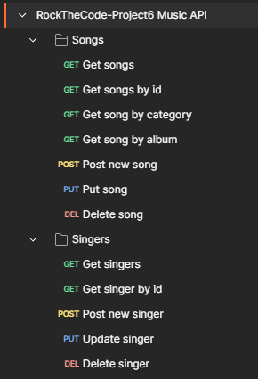

# RockTheCode Proyecto 6: API de música

>[!CAUTION]
>Por favor lea todos los punto del README para un correcto uso del proyecto. Gracias.

## 💡 Descripción

Este proyecto consiste en una aplicación en la que el usuario puede tratar los datos tanto de **Canciones** (songs) como de **Artistas** (singers).

Toda la funcionalidad es a través de API por lo que no existe ninguna funcionalidad a través de web.

## 💼 Guía del proyecto

Toda la funcionalidad de la aplicación es a través de API; y ya que tenemos dos colecciones de datos en nuestra base de datos, vamos a tener un CRUD completo para cada una.


<p align="center"><em>Colección de Postman</em></p>

## 💻 Instalación

1. Clonar el repositorio:
```
    git clone https://github.com/ArianaMartinMartinez/RockTheCode-Proyecto6.git
```

2. Instalar las dependencias del package.json:
```
    npm install
```

3. Ejecutar el proyecto:

    - Para desarrollo:
    ```
        npm run dev
    ```

    - Para producción
    ```
        npm run start
    ```

Con todo esto será posible usar la API del proyecto con la URL que aparece con este último comando (http://localhost:3000).

## 🔍 API Endpoints

### Songs / Canciones

>[!NOTE]
>Category of a song can only be: classic, jazz, pop, rock, country, techno, flamenco, reggaeton, rap or alternative

- GET (mostrar todas las canciones)
```
    http://localhost:3000/api/v1/songs
```

- GET BY ID (mostrar una canción según su ID)
```
    http://localhost:3000/api/v1/songs/:id
```

- GET BY CATEGORY (mostrar canciones según su categoría)
```
    http://localhost:3000/api/v1/songs/category/:category
```

- GET BY ALBUM (mostrar canciones según el albúm al que pertenecen)
```
    http://localhost:3000/api/v1/songs/album/:album
```

- POST (insertar una nueva canción)
```
    http://localhost:3000/api/v1/songs

    {
        "name": "Example",
        "duration": 1,
        "album": "Example",
        "category": "classic"
    }
```

- PUT (modificar una canción)
```
    http://localhost:3000/api/v1/songs/:id

    {
        "name": "Example",
        "duration": 1,
        "album": "Example",
        "category": "classic"
    }
```

- DELETE (eliminar una canción)
```
    http://localhost:3000/api/v1/songs/:id
```

### Singers / Cantantes

- GET (mostrar todas los cantantes)
```
    http://localhost:3000/api/v1/singers
```

- GET BY ID (mostrar un cantante según su ID)
```
    http://localhost:3000/api/v1/singers/:id
```

- POST (insertar un nuevo cantante)
```
    http://localhost:3000/api/v1/singers

    {
        "name": "Example",
        "photo": "Example_photo_url"
        "songs": []
    }
```

- PUT (modificar un cantante)
```
    http://localhost:3000/api/v1/singers/:id

    {
        "name": "Example",
        "photo": "Example_photo_url"
        "songs": []
    }
```

- DELETE (eliminar un cantante)
```
    http://localhost:3000/api/v1/singers/:id
```

## 🛠️ Tecnologías y herramientas

<a href='https://github.com/shivamkapasia0' target="_blank"></a>
<a href='https://github.com/shivamkapasia0' target="_blank"></a>
<a href='https://github.com/shivamkapasia0' target="_blank"></a>


<a href='https://github.com/shivamkapasia0' target="_blank"></a>
<a href='https://github.com/shivamkapasia0' target="_blank"></a>

## 👨🏻‍💻 Autora

Este proyecto fue desarrollado completamente por:

[Ariana Martín Martínez](https://github.com/ArianaMartinMartinez)